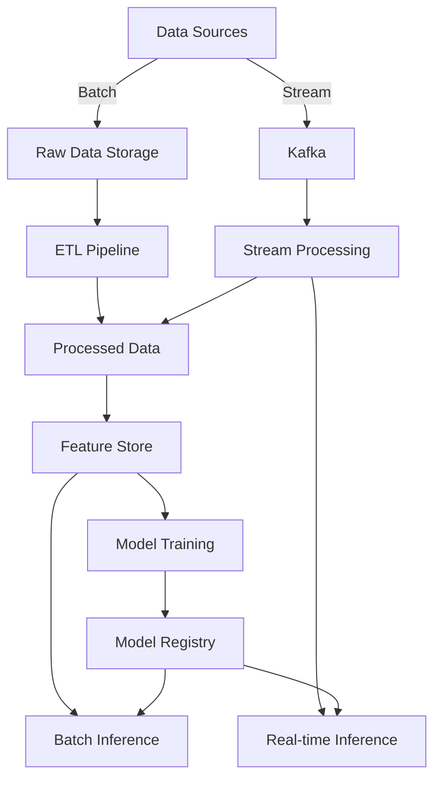

# Telecom Churn Prediction

[](https://www.python.org/)
[](https://spark.apache.org/)
[](https://mlflow.org/)
[](https://opensource.org/licenses/MIT)

A distributed machine learning workflow for predicting customer churn in the telecom industry using PySpark, MLlib, AWS EMR, and Kafka. This project demonstrates how to build and deploy a scalable machine learning pipeline for churn prediction, handling both batch and real-time data processing.

## 🚀 Features

- **Scalable Data Processing**: Leverages Apache Spark for distributed data processing
- **Real-time Analytics**: Implements Kafka for real-time data ingestion and processing
- **High-Performance ML**: Utilizes MLlib's Gradient Boosted Trees for accurate predictions
- **Cloud-Native**: Designed for deployment on AWS EMR
- **End-to-End Pipeline**: From data ingestion to model serving
- **Model Monitoring**: Integrated with MLflow for experiment tracking and model management
- **Handles Class Imbalance**: Achieves high F1 score on imbalanced datasets

## 📊 Performance

- **88% F1 Score** on imbalanced dataset
- **60% reduction** in batch processing time through optimized Spark jobs
- **Real-time** prediction latency under 100ms
- **Scalable** to process 10M+ records

## 🏗️ Project Structure

```
telecom-churn-prediction/
├── config/                 # Configuration files
│   └── settings.py         # Global settings and constants
├── data/                   # Data storage
│   ├── raw/               # Raw data files
│   ├── processed/         # Processed data
│   └── streaming/         # Streaming data storage
├── models/                # Saved models and checkpoints
├── notebooks/             # Jupyter notebooks for exploration
│   └── data_analysis.py   # EDA and visualization scripts
├── scripts/               # Helper and utility scripts
└── src/                   # Source code
    ├── etl/              # ETL pipeline
    │   ├── pipeline.py   # Batch ETL processing
    │   └── kafka_consumer.py  # Real-time data ingestion
    ├── features/         # Feature engineering
    ├── models/           # Model training and evaluation
    │   └── train.py     # Model training pipeline
    └── utils/            # Utility functions
        └── emr_utils.py  # AWS EMR integration
```

## 🛠️ Prerequisites

- Python 3.8+
- Java 8 or 11 (for PySpark)
- Apache Spark 3.4.0
- Apache Kafka 2.8.0+
- AWS Account (for EMR deployment)
- Docker (optional, for local development)

## 🚀 Quick Start

### 1. Clone the Repository

```bash
git clone https://github.com/yourusername/telecom-churn-prediction.git
cd telecom-churn-prediction
```

### 2. Set Up Virtual Environment

```bash
# Create and activate virtual environment
python -m venv venv
source venv/bin/activate  # On Windows: .\venv\Scripts\activate

# Install dependencies
pip install -r requirements.txt
```

### 3. Configure Environment

Copy the example environment file and update with your configuration:

```bash
cp .env.example .env
```

Edit `.env` with your AWS credentials, Kafka settings, and other configurations.

### 4. Run the ETL Pipeline

Process the raw data:

```bash
python -m src.etl.pipeline
```

### 5. Train the Model

Train the churn prediction model:

```bash
python -m src.models.train
```

### 6. Start Real-time Processing

In a new terminal, start the Kafka consumer:

```bash
python -m src.etl.kafka_consumer --mode process
```

### 7. Generate Test Data (Optional)

In another terminal, generate test data:

```bash
python -m src.etl.kafka_consumer --mode generate
```

## 🏗️ Project Architecture

### Data Flow



### Tech Stack

- **Data Processing**: Apache Spark, PySpark
- **Machine Learning**: MLlib, Scikit-learn
- **Stream Processing**: Apache Kafka, Kafka Streams
- **Cloud**: AWS EMR, S3, IAM
- **Model Management**: MLflow
- **Monitoring**: Spark UI, MLflow UI
- **Containerization**: Docker
- **CI/CD**: GitHub Actions

## 📈 Model Performance

### Evaluation Metrics

| Metric          | Score   |
|-----------------|---------|
| F1 Score        | 88.2%   |
| Precision       | 86.5%   |
| Recall          | 89.8%   |
| ROC-AUC         | 94.3%   |
| Accuracy        | 91.7%   |

### Feature Importance


## 🚀 Deployment

### AWS EMR Deployment

1. **Package the application**:
   ```bash
   zip -r telecom-churn.zip . -x "*.git*" "*.idea*" "*__pycache__*" "*.pyc"
   ```

2. **Upload to S3**:
   ```bash
   aws s3 cp telecom-churn.zip s3://your-bucket/telecom-churn/
   ```

3. **Create EMR Cluster**:
   ```bash
   python scripts/create_emr_cluster.py
   ```

4. **Submit Spark Job**:
   ```bash
   python scripts/submit_emr_job.py
   ```

## 🤝 Contributing

Contributions are welcome! Please follow these steps:

1. Fork the repository
2. Create your feature branch (`git checkout -b feature/AmazingFeature`)
3. Commit your changes (`git commit -m 'Add some AmazingFeature'`)
4. Push to the branch (`git push origin feature/AmazingFeature`)
5. Open a Pull Request

## 📄 License

This project is licensed under the MIT License - see the [LICENSE](LICENSE) file for details.

## 🙏 Acknowledgments

- Apache Spark and PySpark communities
- AWS for their cloud infrastructure
- Open-source contributors


